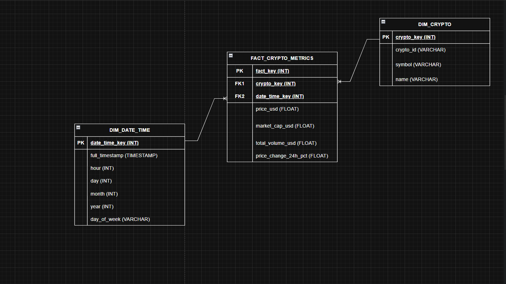

**Markdown**

```
#  End-to-End Cryptocurrency Big Data Pipeline & Business Intelligence Dashboard

##  Project Overview
This project delivers a robust, automated Big Data architecture designed to ingest, process, store, and visualize real-time cryptocurrency metrics. Built with a modern Data Engineering stack, the pipeline extracts raw data into a localized Data Lake, models it using a structured Medallion Architecture via Apache Airflow orchestration, and stores it within a Cloud Data Warehouse (Snowflake) for interactive BI analysis.

---

##  System Architecture & Data Flow

```text
  [ API / Ingestion ]
           │
           ▼
   ┌───────────────┐
   │  VS Code /    │ ──► [ Ingest to Bronze ] ──► Store Raw Parquet in MinIO (Bronze Bucket)
   │  Airflow DAGs │ ──► [ Transform to Silver ] ──► Cleaned Time-Series in MinIO (Silver Bucket)
   └───────────────┘ ──► [ Load to Gold ] ──► Final Star Schema Loaded into Snowflake Warehouse
           │
           ▼
    [ Tableau BI ] ──► Multi-criteria Analytics & Interconnected Dashboards
```

1. **Orchestration Layer (Apache Airflow):** The entire workflow is controlled dynamically via an Airflow Orchestrator (`airflow_orchestrator`) containerized via Docker Compose^^.
2. **Storage Layer (MinIO Data Lake):** An S3-compatible object storage infrastructure serving as our localized multi-tier Lakehouse^^.
3. **Data Warehousing (Snowflake DWH):** Automated target loading using dimensional modeling constructs optimized for analytical querying^^.

## 📂 Project Directory Structure 

As structured and deployed within the development environment shown in `image_d330d9.png`, the workspace is organized into highly decoupled pipeline layers:

* **`dags/`** : Contains the primary Airflow execution workflows (`crypto_pipeline_dag.py`) that trigger jobs chronologically.
* **`scripts_pipeline/`** : The core execution logic separated into clean ETL steps aligned with the Medallion framework:
* `ingest_to_bronze.py`: Fetches raw currency data and persists it into the **Bronze** layer as raw immutable files.
* `transform_to_silver.py`: Standardizes column structures, formats datatypes, and applies transformations into the **Silver** data tier.
* `load_to_gold.py`: Runs dimensional mapping and upserts production-grade metrics into the **Gold** layer.
* `load_to_warehouse.py`: Handles direct pipeline execution scripts targeting remote tables.
* **`config/`** : Holds environmental configs, credentials, and structural pipeline configurations.
* **`database_local/`** : Local caching layers and transactional audit metadata logs (`crypto_warehouse...`).
* **`docker-compose.yml`** : Defines microservices initialization (`minio`, `airflow`), establishing isolated environments, networking, and volumes mappings (`minio_data`).
* **`.env`** : Encapsulates sensitive environmental variables and API keys.

## 📊 Dimensional Data Modeling (Star Schema)

Following data processing and transformation, the warehouse layer transforms the relational tables into an analytical **Star Schema** deployed in Snowflake, illustrated precisely in the entity-relationship diagram :



### Data Dictionary

#### 1. `FACT_CRYPTO_METRICS` (Fact Table)

* **`fact_key`** (INT, PK): Unique system identifier for each financial transaction snapshot.
* **`crypto_key`** (INT, FK): Foreign key linking directly to crypto dimensions.
* **`date_time_key`** (INT, FK): Foreign key mapping transaction windows to granular time segments.
* **`price_usd`** (FLOAT): Current unit price value formatted in USD^^.
* **`market_cap_usd`** (FLOAT): Total aggregate market capitalization value.
* **`total_volume_usd`** (FLOAT): Total cumulative 24-hour trading volume.
* **`price_change_24h_pct`** (FLOAT): Exact 24-hour percentage fluctuation metrics.

#### 2. `DIM_CRYPTO` (Dimension Table)

* **`crypto_key`** (INT, PK): Primary surrogate key representing individual assets.
* **`crypto_id`** (VARCHAR): String identifier designated by the target framework.
* **`symbol`** (VARCHAR): Standard market ticker notation (e.g., BTC, ETH, BNB).
* **`name`** (VARCHAR): Comprehensive legal asset moniker.

#### 3. `DIM_DATE_TIME` (Dimension Table)

* **`date_time_key`** (INT, PK): Primary surrogate key enforcing temporal ordering.
* **`full_timestamp`** (TIMESTAMP): Complete unaltered datetimestamp string.
* **`hour` / `day` / `month` / `year`** (INT): Explicit time partitions enabling quick performance drill-downs.
* **`day_of_week`** (VARCHAR): Named text representation identifying active execution days.

## 📉 Tableau BI Dashboard Features (Restitution Layer)

The presentation layer consumes data directly from the Snowflake Star Schema via interactive interface segments:

### 1. Dashboard Principal (Macro View)

* **KPI Cards:** Dynamically presents core calculations using customized metric selection criteria.
* **Top 10 Assets Bar Chart:** Filters the highest liquidity tokens based on dynamic calculations of average transaction volume.
* **Scatter Plot Analysis:** Evaluates risk metrics by cross-examining transaction volume against daily price volatility percentages.

### 2. Dashboard Détail & Interactivity (Micro View)

* **Heatmap Matrix:** Visualizes immediate market fluctuations mapped across weekdays and historical time progressions.
* **Drill-Down Filter Action:** Selecting a specific cryptocurrency asset trigger via the custom navigation rule `Zomer sur la Crypto` pipes dynamic filters and automatically transitions the viewer onto the target deep-dive worksheet.

## 🛠️ Tech Stack & Infrastructure

* **Orchestration & Virtualization:** Apache Airflow, Docker, Docker Compose
* **Languages:** Python (Pandas, SQLAlchemy), SQL
* **Storage Frameworks:** MinIO (S3 Lakehouse), Snowflake Cloud Data Warehouse
* **Business Intelligence Engine:** Tableau Desktop
